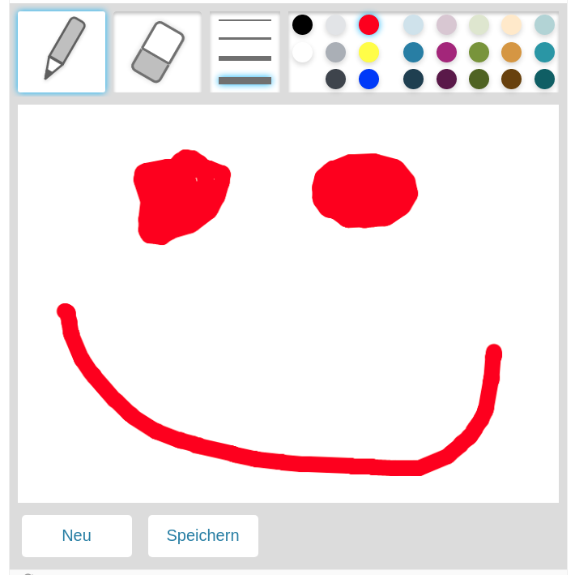

# h5p-plugins

Docker image taken from [sr258/drupal-h5p-docker](https://github.com/sr258/drupal-h5p-docker).


## Requirements

- `docker` & `docker-compose`
- `npm` & `node`

## Usage

1. Run docker container:
    ```
    $> docker-compose up -d
    ```
2. Go to [localhost:8080](http://localhost:8080)
3. Login as user: `admin`, password: `admin`
4. Go to `modules`
5. Scroll down to `Other`, click on `configure` on `H5P`
6. Tick `Enable H5P development mode`
7. Tick `Enable library development directory (For programmers only)`


## Plugins

### H5P Drawing Board

A simple canvas drawing board.

